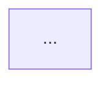

# design-system

Produces a complete architecture plan for the orchestrator to review with the user before any implementation begins.

## Determine mode

Before proceeding, identify the mode from the brief:

- **Greenfield**: new system, no existing architecture to consider.
- **Expansion**: new feature, module, or refactor on top of an existing system.

If the brief does not make this clear, ask the orchestrator before proceeding.

---

## Mode: Greenfield

### Step 1 — Read project context

Read:
- `docs/INDEX.md`
- `docs/architecture/INDEX.md` (may not exist yet)
- Project CLAUDE.md — stack, patterns, constraints

### Step 2 — Work through the checklist

Go through every area. For each one: assess whether it applies, make a decision or flag it as open, and document the rationale. Do not skip areas silently — if something does not apply, state why.

See `references/checklist.md` for the full checklist.

### Step 3 — Produce the plan

Use the plan format below. Embed Mermaid diagrams inline — do not write files to `docs/`.

### Step 4 — Return to orchestrator

Return the full plan. The orchestrator presents it to the user for approval or revision. Do not proceed to implementation.

---

## Mode: Expansion

### Step 1 — Read current architecture

Read:
- `docs/INDEX.md`
- `docs/architecture/INDEX.md`
- `docs/architecture/<module>.md` for all modules relevant to the expansion
- `docs/decisions/` — existing ADRs
- Project CLAUDE.md

### Step 2 — Map impact on existing system

Before designing anything new, explicitly identify:

- **Modules affected**: which existing modules will change behavior, interface, or data.
- **Contracts at risk**: API routes, events, or DB schemas that may need to change.
- **Dependencies introduced**: will the new feature depend on existing modules, or vice versa.

Document this as the **Impact map** section of the plan.

### Step 3 — Work through the checklist

Same as Greenfield Step 2, but scoped to what is new or changing. For areas already solved by the existing system (e.g., auth already exists), note "covered by existing system" and move on — do not redesign unless the expansion requires it.

See `references/checklist.md` for the full checklist.

### Step 4 — Produce the plan

Use the plan format below. Embed Mermaid diagrams inline.

### Step 5 — Return to orchestrator

Same as Greenfield Step 4.

---

## Plan format

```markdown
# System design: <feature or system name>

**Mode:** Greenfield | Expansion
**Date:** <YYYY-MM-DD>
**Status:** Draft — pending user approval

## Summary
<Two to three sentences: what is being built, what problem it solves, and the core architectural approach.>

## Impact map
<Expansion only. List of existing modules, contracts, and dependencies affected. Be explicit — do not bury impacts inside other sections.>

## Architecture decisions

### Infrastructure
<Server, hosting, deployment approach. Justify choices.>

### Data
<DB engine, schema overview, data ownership per module. Flag irreversible decisions.>

### Cache
<Whether caching is needed, what layer, what gets cached and for how long. If not needed, state why.>

### Auth
<Authentication and authorization approach. Roles, session strategy, token handling.>

### Integrations
<External APIs, services, or queues. Protocols, failure handling, credential strategy.>

### Rate limiting
<Where rate limiting applies and at what layer.>

### Backups
<Backup strategy for persistent data. Frequency, retention, recovery path.>

### Maintenance mode
<How the system can be taken offline without breaking clients. Env var trigger, user-facing behavior.>

### Data collection & audit
<What events or user actions need to be tracked for business or compliance reasons. Audit trail requirements.>

### Cost considerations
<Estimated or relative cost of infrastructure and integration choices. Flag anything with variable cost at scale.>

## Data flow
<Mermaid diagram showing how data moves through the system for the primary use case.>



## Module structure
<Mermaid diagram showing modules, their boundaries, and dependencies.>


## Open questions
<Decisions that could not be made with available information. Each one blocks or conditions part of the plan — state which part.>

## Flagged for ADR
<Decisions significant enough to warrant an ADR once the plan is approved. List them — the orchestrator will invoke generate-adr after approval.>
```

---

## Key behaviors

- **Flag irreversible decisions explicitly.** DB schemas, public API contracts, persisted data formats. These require deliberation before the plan is approved.
- **Do not design what is already solved.** In Expansion mode, reuse existing decisions — do not redesign for the sake of it.
- **Do not write to docs/.** The plan is a draft until the user approves it. The orchestrator handles persistence after approval.
- **Ask when uncertain.** If a checklist area cannot be assessed without information not in the brief or project docs, raise it as an open question — do not assume.

---

## References

- `references/checklist.md` — Full checklist of areas to cover, with guiding questions per area.
